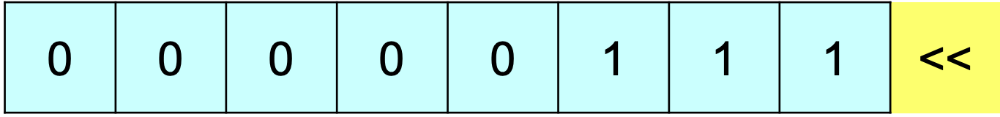

# Les opérateurs en C

## Opérateurs proposés par C :

- Arithmétiques binaires : `+ - * / %`
- D'affectation simple et composée : `= += -= *= /= %=`
- De pré et post incré-/décrémentation : `++ -—`
- De comparaison `< ≤ == ≠ ≥ >`
- Logiques `&& ||`

Les opérateurs `and` et `or` n'existent pas en C

## Opérateur `&`

Cet opérateur à deux significations en C/C++ :

- **AND bit à bit** dans les expressions
- fournit l'**adresse d'une variable**

```c
**// Opérateur bit à bit**
unsigned a = 3u, b = 7u, c;
c = a & b; // => 3 (détaillé plus tard)

**// Adresse mémoire**
int i = 0;
int* ptr = &i; // ptr contient l'adresse de i
```

## Opérateur `*`

L'opérateur `*` a trois significations en C/C++ :

- Opérateur de multiplication (opérateur binaire)
- Déclaration d'une variable de type pointeur
- Accès à une valeur stockée à une adresse spécifique "déréférencement"

```c
int i = 3 * 7; // multiplication
int* ptr = &i; // déclaration
int a = *ptr; // déréférencement
```

Les opérateurs `*` et `&` seront utilisés pour le passage de paramètres par adresse (par pointeur)
dans le cadre des fonctions

## Opérateurs de manipulation de bits

Ces opérateurs permettent d'effectuer des opérations au niveau des bits d’information, ils sont notamment utilisés dans les cas suivants :

- programmation système : compilateurs, OS, etc.
- cryptographie, traitements graphiques, …
- lorsque la vitesse et l’espace mémoire sont des paramètres essentiels

Le langage C fournit six opérateurs de manipulation de bits (*bitwise operators)* :

- Opérateurs logiques `**& | ^ ~**`
- Décalage à gauche `**<<**` et à droite `**>>**`

## Opérateurs de décalage

### Décalage à gauche

Le résultat de `**i << j**` est la valeur de `**i**` en binaire avec les bits décalés vers la gauche de `**j**` positions.

- Les bits qui débordent à gauche sont perdus
- Pour chaque bit décalé, on ajoute un 0 à droite

```c
uint8_t i = (uint8_t)7;
i = i << 1; // i devient 14
```



Un décalage d’une position à gauche revient à faire une multiplication de la valeur par 2 :

```c
i = i << 1; // fois 2
i = i << 2; // fois 4
i = i << 3; // fois 8
i = i << n; // fois 2^n
```

### Décalage à droite

Le résultat de **`i >> j`** est la valeur de **`i`** en binaire avec les bits décalés vers la droite de **`j`** positions.

- Les bits qui débordent à droite **sont perdus**
- Le ou les bits insérés à gauche **dépendent du compilateur** (0 ou valeur du signe)

```c
uint8_t i = (uint8_t)15;
i = i >> 1; // i devient 7
```


Un décalage d’une position à droite revient à faire une division entière de la valeur par 2 :

```c
i = i >> 1; // div. par 2
i = i >> 2; // div. par 4
i = i >> 3; // div. par 8
i = i >> n; // div. par 2^n
```

## Les opérateurs logiques bit à bit


```c
uint8_t i = (uint8_t)14,  // 0000 1110
				j = (uint8_t)246; // 1111 0110

// opérateurs bit à bit
uint8_t et = i & j, // 0000 0110 =>   6
				ou = i | j, // 1111 1110 => 254
				ex = i ^ j; // 1111 1000 => 248

// opérateurs logiques (rappel)
bool a, b;
	a = !i;      // => false
	a = !i || j; // => true
	b = !i && j; // => false
```

## Les opérateurs d'affectation composée

Tout comme les opérateurs d’affectation composée **`+= -= *= /= %=`** le C / C++ propose des opérateurs similaires pour les opérateurs de manipulation bit à bit **`&= |= ^= <<= >>=`**

```c
uint8_t i = (uint8_t)14,  // 0000 1110
				j = (uint8_t)246; // 1111 0110

				i &= j;  // 0000 0110 =>   6
i = 14; i |= j;  // 1111 1110 => 254
i = 14; i ^= j;  // 1111 1000 => 248

				i >>= 3; // 0001 1111 =>  31
				i <<= 2; // 0111 1100 => 124
```

## Usages fréquents (1 bit)

```c
// Déterminer la valeur d'un bit spécifique
unsigned bit = 3u;
unsigned valeur = 125u; // 0111 1101
unsigned shift = valeur >> bit; // 0000 1111
unsigned checkBit = (valeur >> bit) & 1u; // 0000 0001
```

```c
// Mettre un bit à 0
unsigned bit = 2u;
unsigned valeur = 125u; // 0111 1101
unsigned mask = 1u << bit; // 0000 0100
unsigned bitTo0 = valeur & ~mask; // 0111 1001
// Mettre un bit à 1
unsigned bitTo1 = bitTo0 | mask; // 0111 1101
// Mettre un bit à X (X à remplacer par 0 ou 1)
unsigned valeur = (valeur & ~(1u << bit)) | (X << bit);
// \ efface le bit / \ bit à X /
```

## Usages fréquents (mask)

```c
// effacer un ou plusieurs bits
unsigned valeur = 125u; // 0111 1101
unsigned mask = 15u; // ou 0xF // 0000 1111
unsigned resetBits = valeur & ~mask; // 0111 0000
```

```c
// setter un ou plusieurs bits
unsigned valeur = 125u; // 0111 1101
unsigned mask = 15u; // 0000 1111
unsigned setBits = valeur | mask; // 0111 1111
```

```c
// inverser (toggle) un ou plusieurs bits
unsigned valeur = 125u; // 0111 1101
unsigned mask = 15u; // 0000 1111
unsigned toggleBits = valeur ^ mask; // 0111 0010
```
